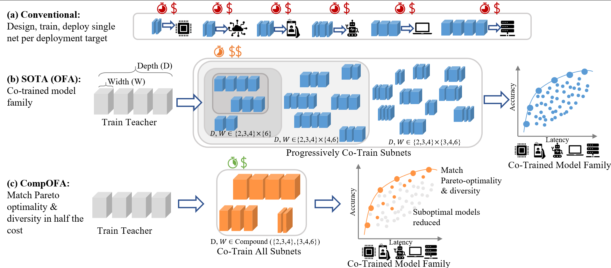
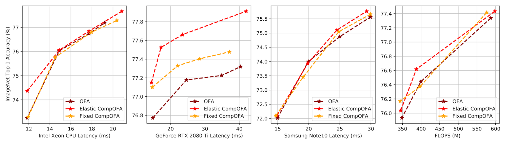
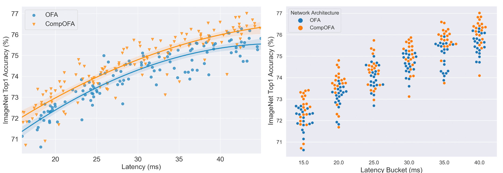

# CompOFA – Compound Once-For-All Networks for Faster Multi-Platform Deployment 
### Accepted as a conference paper at ICLR 2021 [[OpenReview]](https://openreview.net/forum?id=IgIk8RRT-Z)
Note: This implementation is adopted from the source code of [Once For All (Cai et al. 2019)](https://github.com/mit-han-lab/once-for-all)

## Citation
If you find the code useful for your work, please consider citing
```bibtex
@inproceedings{compofa-iclr21,
  author = {Manas Sahni and Shreya Varshini and Alind Khare and Alexey Tumanov},
  title = {{C}omp{OFA}: Compound Once-For-All Networks for Faster Multi-Platform Deployment},  
  booktitle = {Proc. of the 9th International Conference on Learning Representations},
  series = {ICLR '21},
  month = {May},
  year = {2021},
  url = {https://openreview.net/forum?id=IgIk8RRT-Z}
}
```

## Compound Once-for-all Networks
CompOFA is a model design space that exploits the insight of compound couplings between model dimensions of a CNN to vastly simplify the search space while maintaining Pareto optimality. The smaller space can be trained in half the time without phases, and gives equally performant and diverse model families.



## Pareto-Optimality and Density Maintained
CompOFA networks consistently achieve comparable and higher ImageNet accuracies for similar latency and FLOP constraints on CPU, GPU and mobile platforms.



## Reduced Train and Search Time
Through experiments on ImageNet, we achieve a 2x reduction in training time and 216x speedup in model search time as compared to the state of the art, *without* loss of Pareto optimality!

|                          |  OFA      |  CompOFA       |
|--------------------------|-----------|----------------|
|**Train Time (GPU Hours)**|  978.3    |  **493.5**     |
|**Train Cost**            |  $2.4k    |   $1.2k        |
|**CO2 emission (lbs)**    |   277     |    128         |
|**Search Time**           | 4.5 hours | **75 seconds** |

## Outperforms OFA on Overall Average Accuracy
CompOFA also yields a higher average accuracy, i.e. as a population it has a higher concentration of accurate models.



## Dependencies
Tested with:
- Python 3.7
- `torch` 1.3.1
- `torchvision` 0.4.2
- `horovod` 0.19.3 for multi-GPU training

## Training CompOFA
```
[horovodrun -np <num_gpus> -H <node1:num_gpus>,<node2:num_gpus>...] python train_ofa_net.py --task compound --phase 1 --fixed_kernel --heuristic simple
```


## Pretrained Models
`./ofa/checkpoints/` directory contains pre-trained models for CompOFA-MobileNetV3 with fixed kernel and elastic kernel.


## Evaluating trained Models
See `eval_sampled_config.py` for example on sampling a random *compound* subnet of CompOFA and validating its top-1 accuracy
```
python eval_sampled_config.py --net <PRETRAINED_PATH> --imagenet_path <IMAGENET_PATH>
```


## Searching Trained Network
In the NAS directory run the following command to execute the Neural Architecture Search for finding the optimal sub-networks for its corresponginf target latency.
```
python run_NAS.py --net=<OFA_NETWORK> --target-hardware=<TARGET_HARDWARE> --imagenet-path <IMAGENET_PATH>
```
**--net** takes in the name of the specific type of model to carry out NAS on:
1. `'compofa'` : CompOFA with fixed kernel
2. `'compofa-elastic'` : CompOFA with elastic kernel
3. `'ofa_mbv3_d234_e346_k357_w1.0'` : OFA network

**--target-hardware** takes in the type of deployment hardware that guides the latency-specfic NAS:
1. `'note10'`
2. `'gpu'`
3. `'cpu'`
